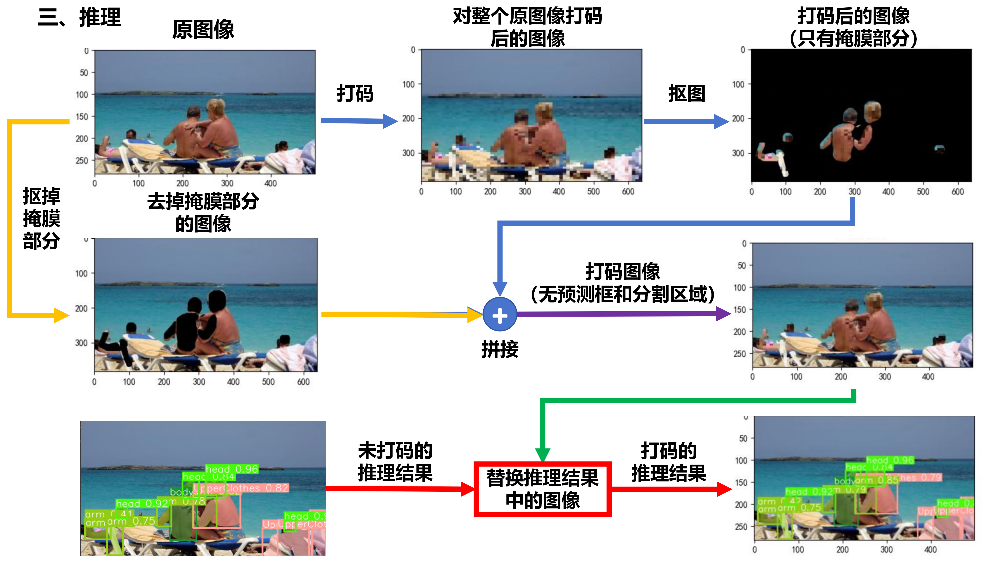
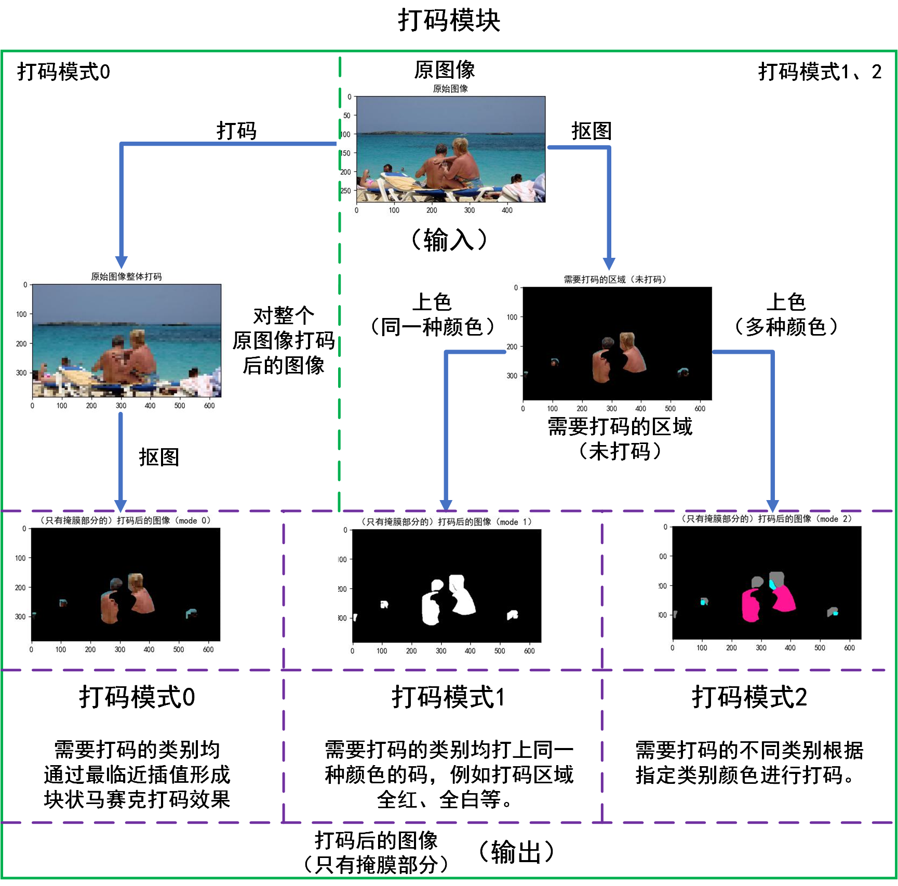
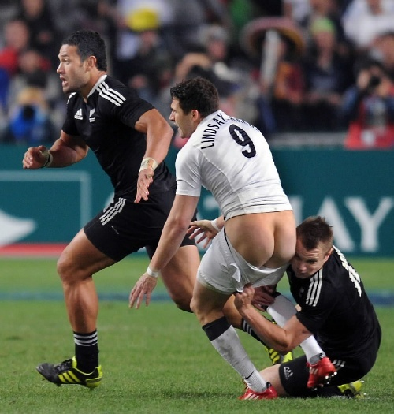

# YOLOv8-Segmentation-Mosaic: 基于YOLOv8语义分割模型的智能打码工具

## 📋 项目简介

本项目基于YOLOv8语义分割模型，可用于对模型输出中**指定类别**的分割区域（掩膜）进行打码。该工具支持处理图片、视频（含摄像头实时流），并提供**像素马赛克**、**单色马赛克**、**多色马赛克**三种打码模式。

> - 用户通过设置**类别序号**（如 mosaic_index = [0,5,8]），即可对所有属于该类别的分割区域进行打码，打码范围与模型预测的分割掩膜边界完全一致。打码的精确度直接依赖于底层YOLOv8分割模型推理的质量：模型分割得越准，打码的范围就越贴合目标轮廓。
> - 本项目源于研究生期间的小型研究项目，经历了prediction_mosaic.py、prediction_mosaic_dlc.py和prediction_mosaic_dlc_up.py三个版本的迭代演进，功能逐步完善。**完整的技术细节、实现原理、演进过程等，请参考项目中的[三个代码](code/YOLOv8_mosaic/ultralytics-main)、[PPT文件夹](PPT和作图)和[完整的解说视频](视频说明)。**
> - 关于打码的代码可以用于图片、视频或摄像头，可以将文件路径列表传进去（可以混合以上三种文件情况），代码运行时会根据文件路径顺序逐个打码（视频是对若干帧打码再合成一个视频，摄像头同理）。

---

## 📁 项目结构

<details open>
<summary><b>核心文件与目录</b></summary>

以下为本项目的主要目录结构。核心源代码和数据均位于`📂 ultralytics-main/`文件夹下。

```plaintext
YOLOv8-Segmentation-Mosaic/
├── 📂 code/                  # 源代码目录
│   └──  📂 YOLOv8_mosaic/
│        ├── 📂 pycococreator-master/  # COCO数据集格式转换工具库
│        └──  📂 ultralytics-main/   # 项目核心代码和数据
│             ├── 📂 dataset/   # 数据集文件夹
│             ├── 📂 predict_files/   # 用于推理测试的示例图片与视频
│             ├── 📂 runs/   # 训练和验证结果（含权重文件）
│             ├── 📄 prediction_mosaic.py        # 打码程序（v1.0基础版）
│             ├── 📄 prediction_mosaic_dlc.py    # 打码程序（v2.0增强版）
│             ├── 📄 prediction_mosaic_dlc_up.py # 打码程序（v3.0优化版）
│             ├── 📄 jpg2png.py       # 图片格式转换工具（JPG → PNG）
│             ├── 📄 json2txt.py      # 标注格式转换工具（Labelme JSON → YOLO TXT）
│             ├── 📄 json2txt_show.py # # 标注可视化检查工具（Labelme JSON → YOLO TXT）
│             ├── 📄 mask2coco.py        # 标注格式转换工具（掩码 → COCO JSON）
│             ├── 📄 spilit_dataset.py   # 数据集划分脚本（训练集/验证集）
│             └── 📄 results_plt.py      # 训练结果曲线可视化
├── 📂 PPT和作图/              # 项目讲解PPT
├── 📂 视频说明/               # 功能解说与演示视频
├── 📂 demo/                 # 存放所有演示素材（GIF、MP4等）
├── 📄 README.md        # 项目说明文档（英文）
└── 📄 README_zh.md     # 项目说明文档（中文）
```
</details>

---

## 📁 核心文件版本演进
本项目包含三个核心版本文件，展示了功能逐步完善的演进过程：

|    版本     |               文件               |            支持打码模式             |                  主要特点                   |   推荐度    |
|:---------:|:------------------------------:|:-----------------------------:|:---------------------------------------:|:--------:|
|  v1.0基础版  |     `prediction_mosaic.py`     |      仅支持像素马赛克<br/>（模式0）       |     基础打码功能，仅支持像素马赛克；<br/>不支持透明度调节。      |   ★☆☆    |
|  v2.0增强版  |   `prediction_mosaic_dlc.py`   |  支持像素、单色、多色马赛克<br/>（模式0、1、2）  |      支持三种打码模式，可自定义颜色；<br/>支持透明度调节。      |   ★★☆    |
|  v3.0优化版  | `prediction_mosaic_dlc_up.py`  |  支持像素、单色、多色马赛克<br/>（模式0、1、2）  |  在v2.0增强版的基础上，颜色设置统一化，<br/>配置更简洁，推荐使用。  |   ★★★    |

---

## ✨ 三种打码模式

### 🎨 模式0: 像素马赛克
- **实现原理**：通过最临近插值缩小再放大，形成块状马赛克效果
- **核心参数**：`mosaic_size`（马赛克块大小）

### 🎨 模式1: 单色马赛克
- **实现原理**：所有类别的打码区域用同一种颜色填充
- **颜色设置**：支持RGB、8种基本颜色、默认掩膜颜色

### 🎨 模式2: 多色马赛克
- **实现原理**：不同类别的打码区域用不同颜色填充
- **颜色配置**：支持RGB、8种基本颜色、默认掩膜颜色

<br/>
<details open>
<summary><b>像素马赛克的生成原理图</b></summary>
<br/>

</details>

<br/>
<details open>
<summary><b>像素、单色、多色马赛克效果图</b></summary>
<br/>

</details>

---

## 🚀 快速开始

### 1. 环境安装

> 只需参考yolov8的环境安装即可。
> <br/>参考视频：https://www.bilibili.com/video/BV13V4y1S7MK/?spm_id_from=333.1391.0.0&vd_source=3e34b6ee0b8dc3763064b64eac827b5a

- **https://github.com/ultralytics/ultralytics && unzip ultralytics-main.zip && cd ultralytics-main**
- **安装依赖：**
```bash 
pip install -e
```

### 2. 配置文件（参数设置）

#### 🔧 基础参数（各版本通用）
在介绍版本差异前，以下参数是三个版本共有的核心设置，决定了打码的目标类别、保存设置等。

> **file_paths可填入所有需要推理的文件对应的路径：包括图片、视频、摄像头（'0'）。**

```python
nc = 19     # 数据集的目标种类数

# 需要打码的类别序号（从0开始）
# mosaic_index = [1, 9, 12]  # CHIP和human_body
mosaic_index = [0]   # COCO

# 保存图片的部分路径
img_dir_begin = './predict_files/predict/human_body-seg/picture'

# 保存视频（录像）的部分路径
video_dir_begin = './predict_files/predict/human_body-seg/video'

# 保存状态
is_save = {'save original image': False,
           'save mosaic image': False,
           'save image of YOLOv8 inference': False,
           'save figure': False,
           'save original video': False,
           'save mosaic video': False,
           'save video of YOLOv8 inference': False}

# 保存状态说明：
# 'save original image': 保存原始图片
# 'save mosaic image': 保存打码图片
# 'save image of YOLOv8 inference': 保存（含打码）图片的YOLOv8分割结果
# 'save figure': 保存打码过程中的所有图片构成的figure窗口（图片形式）
# 'save original video': 保存原始视频（录像）
# 'save mosaic video': 保存打码视频（录像）
# 'save video of YOLOv8 inference': 保存（含打码）视频（录像）的YOLOv8分割结果

...

if __name__ == '__main__':
    # 模型权重
    model = YOLO('./runs/segment/coco128-seg_train5/weights/best.pt')
    
    # 所有需要推理的文件对应的路径
    file_paths = ['predict_files/picture/游泳4.jpg', 'predict_files/video/老实巴蕉.mp4', 'predict_files/picture/游泳男.webp',
                  '0', 'predict_files/picture/其他2.jpg', 'predict_files/picture/其他3.jpeg']
```

<br/>

#### 🔧 各版本特有的参数设置
以下是三个版本在打码模式、颜色配置等方面的具体差异。

<details open>
<summary><b>v1.0基础版 (prediction_mosaic.py) 参数设置</b></summary>

```python
# 打码尺寸（图片先缩小时的尺寸）
mosaic_size = 64
```

</details>

<details open>
<summary><b>v2.0增强版 (prediction_mosaic_dlc.py) 参数设置</b></summary>

```python
# 模式配置
mosaic_mode = 2  # 0=像素, 1=单色, 2=多色
alpha = 1  # 透明度

# 模式0（像素）设置
mosaic_size = 64    # 打码尺寸（图片先缩小时的尺寸）

# 模式1（单色）设置
self_color = False # 是否使用自己设置的单一颜色：True对应self_color，False对应基本色彩
single_color_select = "g"  # 使用预设颜色
# ---或者---
self_color = True
self_mosaic_color = "#FF1493"  # 自定义颜色

# 模式2（多色）设置
self_colors = True # 是否使用自己设置的不同类别的多种颜色：True对应self_colors，False对应掩膜颜色
from_single_color = True # 自己设置的颜色是否均来自于（单色打码模式）的基本色彩
# 自己设置的不同类别的多种颜色（自己设置的RGB值），其中不同行对应需要打码的类别。
# 每个类别可以填入RGB构成的列表，如[255, 255, 255]，也可以填入RGB16进制字符串模式（"#??????"），
# 如"#FF0000"（#不要漏，？=0,1,2,...,9,A,B,C,D,E,F）。
self_mosaic_colors = [[128, 128, 128],
                      "#FF1493",
                      [0, 255, 255]]
# ---或者---
# 由基本色彩构成的list（元素为颜色对应字母），用于映射到对应的RGB值
single_color_list = ["g", "r", "c"]  # 每个类别对应一个颜色
```

</details>

<details open>
<summary><b>v3.0优化版 (prediction_mosaic_dlc_up.py) 参数设置</b></summary>

> **核心改进**: v3.0优化版将v2.0增强版中分离的模式1和模式2颜色设置统一为`self_mosaic_colors`参数，通过列表长度自动判断是单色还是多色模式，大大简化了配置。

```python
# 模式配置
mosaic_mode = 1  # 0=像素, 1=单色/多色
alpha = 1  # 透明度

# 模式0专属设置
mosaic_size = 64  # 马赛克块大小

# 颜色统一设置(模式1)
# self_mosaic_colors：自己设置的不同打码类别的多种颜色，其中不同行对应需要打码的类别。
# self_mosaic_colors的每一行可填入的内容有如下几种形式，其中self_mosaic_colors必须是二维的列表形式（[[?],[?],[?]]）（每一行列表也可以是字符串）：
# (1) self_mosaic_colors的某行填入的是由代表RGB的3个数字构成的列表（可以是0~255内的具体整数灰度值；也可以是（0~1范围内的）归一化灰度值，
# 后面代码可以将归一化值转化为具体值）。例如：某一行[255,0.7,0]。
# (2) self_mosaic_colors的某行填入的是RGB16进制字符串模式（"#??????"），如"#FF0000"（#不要漏，？=0,1,2,...,9,A,B,C,D,E,F）。
# (3) self_mosaic_colors的某行填入的是默认的8种基本颜色对应的字符串（字典single_color的键），如"g"、"r"、"c"，可用于映射到对应的RGB值。
# (4) self_mosaic_colors=[[]]（空列表）：表示使用默认掩膜颜色表中的颜色进行打码。
# 以下是self_mosaic_colors的设置例子（可以多种形式混合）：
# self_mosaic_colors = [[128, 0.5, 0],
#                       "#FF1493",
#                       "g"]

# ---举例---
# 配置方式1: 单色模式
self_mosaic_colors = ["#FF0000"]  # 所有类别用红色

# 配置方式2: 多色模式
self_mosaic_colors =  [[128, 0.5, 0],
                      "#FF1493",
                      "g"]  # 不同类别用不同颜色（可以多种形式混合）

# 配置方式3: 使用默认颜色表
self_mosaic_colors = [[]]  # 自动分配20种区分色
```

</details>

### 3. 运行程序

> 以下将以优化版本 prediction_mosaic_dlc_up.py为例

```bash
python prediction_mosaic_dlc_up.py
```

### 4. 人机交互
#### 窗口控制
- **Figure窗口：** 程序弹出的Figure窗口（如显示打码过程分解图）。请点击窗口右上角的关闭按钮（×），即可关闭该窗口，程序将继续执行后续流程。
- **CV2窗口（图片）：** 当处理图片时，会显示多个CV2窗口。按下键盘任意键，即可同时关闭所有打开的CV2窗口（如原图、不含推理结果的打码图、含推理结果的打码图），程序将继续执行后续流程。
- **CV2窗口（视频/摄像头）：** 当处理视频或实时摄像头时，视频会持续播放。按下空格键或任意字母键（a-z），即可立即退出播放，并同时关闭所有的CV2窗口，程序将继续执行后续流程。

#### 输出保存
- **视频（摄像头）保存时长说明：** 在处理视频或摄像头时，输出文件的保存时长截止于用户主动按下退出键（空格/字母）的时刻。如果视频播放完毕都未按键，则会保存完整的视频内容。
- **输出文件控制：** 通过修改配置字典is_save中的布尔值，可以精确控制需要保存的输出文件类型（例如原始文件、纯打码结果、或带分割结果显示的打码结果）。
- **配置示例：** 假设运行参数设置如下：
  - 输入文件的路径`file_paths = ['predict_files/picture/图片1.jpg'，'predict_files/video/视频1.mp4','0']`（'0'表示摄像头）
  - 保存图片的部分路径`img_dir_begin = './predict_files/predict/CIHP/picture'`
  - 保存视频（录像）的部分路径`video_dir_begin = './predict_files/predict/CIHP/video'`
  - 打码模式`mosaic_mode = 0`（以像素马赛克为例），透明度`alpha = 1`
  - 保存配置字典`is_save`中所有值均设为True

<details open>
<summary><b>运行后将生成如下文件结构</b></summary>

```plaintext
📂 predict_files/             # 输入文件与输出结果目录（也可从其他路径引入输入文件）
├── 📂 picture/               # 输入的素材图片
├── 📂 video/                 # 输入的素材视频
└── 📂 predict/               # 推理结果
    └── 📂 CIHP/              # 使用CIHP数据集权重的推理结果
        └── 📂 picture/       # 输入图片的打码结果
            └── 📂 图片1/       # 图片1.jpg的打码结果
                ├── 📄 Original image of 图片1.jpg              # 图片1.jpg
                ├── 📄 Mosaic image (mode 0 alpha 1).jpg       # 图片1.jpg的打码结果（不显示分割结果）
                ├── 📄 Inference (mode 0 alpha 1).jpg          # 图片1.jpg的打码结果（同时显示分割结果）
                └── 📄 Figure (mode 0 alpha 1).jpg             # 处理过程分解图（Figure窗口）     
        └── 📂 video/         # 输入视频（摄像头）的打码结果
            └── 📂 视频1/       # 视频1.mp4的打码结果
                ├── 📄 Original video of 视频1.mp4              # 视频1.mp4
                ├── 📄 Mosaic video (mode 0 alpha 1).mp4       # 视频1.mp4的打码结果（不显示分割结果）
                └── 📄 Inference (mode 0 alpha 1).mp4          # 视频1.mp4的打码结果（同时显示分割结果）
            └── 📂 webcam/     # 摄像头的实时打码结果
                ├── 📄 Original video of webcam.mp4            # 摄像头输入
                ├── 📄 Mosaic video (mode 0 alpha 1).mp4       # 摄像头输入的打码结果（不显示分割结果）
                └── 📄 Inference (mode 0 alpha 1).mp4          # 摄像头输入的打码结果（同时显示分割结果）
```
</details>

---

## 📸 打码效果展示

<details open>
<summary><b>1. 图像打码</b></summary>

<!-- [](code/YOLOv8_mosaic/ultralytics-main/predict_files/predict/CIHP/picture/其他/Original image of 其他.jpg) -->

<div align="center">
<h3>输入图像</h3>
  <a href="code/YOLOv8_mosaic/ultralytics-main/predict_files/predict/CIHP/picture/其他/Original%20image%20of%20其他.jpg" target="_blank">
    
  </a>
</div>

<div align="center">
<h3>打码效果</h3>

<table style="border-collapse: collapse; width: 100%; max-width: 1000px; text-align: center;">
  <thead>
    <tr style="background-color: #f8f9fa;">
      <th style="padding: 12px; border: 1px solid #dee2e6;">是否同时显示<br/>分割结果</th>
      <th style="padding: 12px; border: 1px solid #dee2e6;">像素马赛克</th>
      <th style="padding: 12px; border: 1px solid #dee2e6;">单色马赛克</th>
      <th style="padding: 12px; border: 1px solid #dee2e6;">多色马赛克</th>
    </tr>
  </thead>
  <tbody>
    <tr>
      <td style="padding: 12px; border: 1px solid #dee2e6; font-weight: bold;">否<br>(纯打码效果)</td>
      <td style="padding: 10px; border: 1px solid #dee2e6;">
        <a href="./code/YOLOv8_mosaic/ultralytics-main/predict_files/predict/CIHP/picture/其他/Mosaic%20image%20(mode%200%20alpha%201).jpg" target="_blank">
          
        </a>
      </td>
      <td style="padding: 10px; border: 1px solid #dee2e6;">
        <a href="./code/YOLOv8_mosaic/ultralytics-main/predict_files/predict/CIHP/picture/其他/Mosaic%20image%20(mode%201%20alpha%201).jpg" target="_blank">
          
        </a>
      </td>
      <td style="padding: 10px; border: 1px solid #dee2e6;">
        <a href="./code/YOLOv8_mosaic/ultralytics-main/predict_files/predict/CIHP/picture/其他/Mosaic%20image%20(mode%202%20alpha%201).jpg" target="_blank">
          
        </a>
      </td>
    </tr>
    <tr>
      <td style="padding: 12px; border: 1px solid #dee2e6; font-weight: bold;">是<br>(含分割显示)</td>
      <td style="padding: 10px; border: 1px solid #dee2e6;">
        <a href="./code/YOLOv8_mosaic/ultralytics-main/predict_files/predict/CIHP/picture/其他/Inference%20(mode%200%20alpha%201).jpg" target="_blank">
          
        </a>
      </td>
      <td style="padding: 10px; border: 1px solid #dee2e6;">
        <a href="./code/YOLOv8_mosaic/ultralytics-main/predict_files/predict/CIHP/picture/其他/Inference%20(mode%201%20alpha%201).jpg" target="_blank">
          
        </a>
      </td>
      <td style="padding: 10px; border: 1px solid #dee2e6;">
        <a href="./code/YOLOv8_mosaic/ultralytics-main/predict_files/predict/CIHP/picture/其他/Inference%20(mode%202%20alpha%201).jpg" target="_blank">
          
        </a>
      </td>
    </tr>
  </tbody>
</table>
<p style="color: #666; font-size: 0.9em; margin-top: 10px;">点击任意图片可查看原图</p>
</div>

</details>

<details open>
<summary><b>2. 视频打码</b></summary>

<div align="center">
<h3>输入视频</h3>
  <a href="code/YOLOv8_mosaic/ultralytics-main/predict_files/predict/CIHP/video/香蕉君鱿鱼游戏一命速通（转载）/Original%20video%20of%20香蕉君鱿鱼游戏一命速通（转载）.mp4" target="_blank">
    
  </a>
</div>

<div align="center">
<h3>打码效果</h3>

<table style="border-collapse: collapse; width: 100%; max-width: 1000px; text-align: center;">
  <thead>
    <tr style="background-color: #f8f9fa;">
      <th style="padding: 12px; border: 1px solid #dee2e6;">是否同时显示<br/>分割结果</th>
      <th style="padding: 12px; border: 1px solid #dee2e6;">像素马赛克</th>
      <th style="padding: 12px; border: 1px solid #dee2e6;">单色马赛克</th>
      <th style="padding: 12px; border: 1px solid #dee2e6;">多色马赛克</th>
    </tr>
  </thead>
  <tbody>
    <tr>
      <td style="padding: 12px; border: 1px solid #dee2e6; font-weight: bold;">否<br>(纯打码效果)</td>
      <td style="padding: 10px; border: 1px solid #dee2e6;">
        <a href="./code/YOLOv8_mosaic/ultralytics-main/predict_files/predict/CIHP/video/香蕉君鱿鱼游戏一命速通（转载）/Mosaic%20video%20(mode%200%20alpha%201).mp4" target="_blank">
          
        </a>
      </td>
      <td style="padding: 10px; border: 1px solid #dee2e6;">
        <a href="./code/YOLOv8_mosaic/ultralytics-main/predict_files/predict/CIHP/video/香蕉君鱿鱼游戏一命速通（转载）/Mosaic%20video%20(mode%201%20alpha%201).mp4" target="_blank">
          
        </a>
      </td>
      <td style="padding: 10px; border: 1px solid #dee2e6;">
        <a href="./code/YOLOv8_mosaic/ultralytics-main/predict_files/predict/CIHP/video/香蕉君鱿鱼游戏一命速通（转载）/Mosaic%20video%20(mode%202%20alpha%201).mp4" target="_blank">
          
        </a>
      </td>
    </tr>
    <tr>
      <td style="padding: 12px; border: 1px solid #dee2e6; font-weight: bold;">是<br>(含分割显示)</td>
      <td style="padding: 10px; border: 1px solid #dee2e6;">
        <a href="./code/YOLOv8_mosaic/ultralytics-main/predict_files/predict/CIHP/video/香蕉君鱿鱼游戏一命速通（转载）/Inference%20(mode%200%20alpha%201).mp4" target="_blank">
          
        </a>
      </td>
      <td style="padding: 10px; border: 1px solid #dee2e6;">
        <a href="./code/YOLOv8_mosaic/ultralytics-main/predict_files/predict/CIHP/video/香蕉君鱿鱼游戏一命速通（转载）/Inference%20(mode%201%20alpha%201).mp4" target="_blank">
          
        </a>
      </td>
      <td style="padding: 10px; border: 1px solid #dee2e6;">
        <a href="./code/YOLOv8_mosaic/ultralytics-main/predict_files/predict/CIHP/video/香蕉君鱿鱼游戏一命速通（转载）/Inference%20(mode%202%20alpha%201).mp4" target="_blank">
          
        </a>
      </td>
    </tr>
  </tbody>
</table>
<p style="color: #666; font-size: 0.9em; margin-top: 10px;">点击任意gif可查看原视频</p>
</div>

</details>

---

## 数据集

> 本项目采用的数据集的训练效果其实挺一般，推荐用户找更合适的数据集单独训练、验证和推理。
> <br/>本项目采用的数据集的具体介绍可参考PPT：[2024.6.2.pptx](PPT和作图/2024.6.2/2024.6.2.pptx)、[2024.6.2（续）.pptx](PPT和作图/2024.6.2/2024.6.2（续）.pptx)和[2024.6.17（对不同数据集的介绍、训练和推理）.pptx](PPT和作图/2024.6.17/2024.6.17（对不同数据集的介绍、训练和推理）.pptx)；以及相关链接（如CSDN、数据集官网等）。

<details open>
<summary><b>相关链接</b></summary>

**1. coco128-seg数据集的介绍**

https://blog.csdn.net/babbycool/article/details/123115899

https://blog.csdn.net/weixin_51031772/article/details/135679015

https://blog.csdn.net/oYeZhou/article/details/112008054

https://blog.csdn.net/XDH19910113/article/details/125299757

**2. CHIP等数据集的介绍**

https://blog.csdn.net/wxf19940618/article/details/83661891

https://blog.csdn.net/qq_41994006/article/details/126191667

https://blog.csdn.net/weixin_41809530/article/details/120237242

https://blog.csdn.net/hyk_1996/article/details/91974621

> 说明：**CHIP**等数据集是含有人体部位（或者衣服躯干、裸露部分）的分割任务数据集。

**3. CHIP等数据集的下载链接**

https://sysu-hcp.net/lip/overview.php

> 如果下载链接失效，可以尝试我的百度网盘（含CHIP、LIP、MHP、BDD100K、CamVid等）：
> <br/>通过网盘分享的文件：YOLOv8掩膜代码和数据集下载 链接: https://pan.baidu.com/s/1mWstrlA_aAaoivoZBXxg6g?pwd=99y4 
> 提取码: 99y4--来自百度网盘超级会员v8的分享

</details>

---

## 🎥 完整解说视频

本项目的完整解说视频如下：
- [prediction_mosaic.mp4](视频说明/prediction_mosaic.mp4)：`prediction_mosaic.py`（v1.0基础版）
- [prediction_mosaic_dlc和prediction_mosaic_dlc_up.mp4](视频说明/prediction_mosaic_dlc和prediction_mosaic_dlc_up.mp4)：`prediction_mosaic_dlc.py`（v2.0增强版）和`prediction_mosaic_dlc_up.py`（v3.0优化版）

> 由于完整解说视频超过10MB，无法直接在GitHub上显示，您可以通过以下方式获取：
> <br/>**1. 从Github下载**
> <br/>**2. 联系作者**
> <br/><b>QQ邮箱：</b>3524345723@qq.com

--- 

## ❓ 其他问题

**Q1：在加上预测框和掩膜颜色前，打码效果还可以；但是加上后可能会因为原本的推理结果图像中掩膜的颜色，导致设置的打码颜色会出现混色情况（颜色不再是打码的颜色，虽然同样能起到打码的效果）。<br/>**
**Q2：实际的实例范围可能会与掩膜有一定偏差。<br/>**
**A1&A2：请参考[2024.6.17（对指定多个类别打码）.pptx](PPT和作图/2024.6.17/2024.6.17（对指定多个类别打码）.pptx)和以下链接：<br/>**
https://blog.csdn.net/weixin_46566149/article/details/136367700
> 记得修改[**plotting.py**](code/YOLOv8_mosaic/ultralytics-main/ultralytics/utils/plotting.py)文件（上传的项目中已经修改好了）
